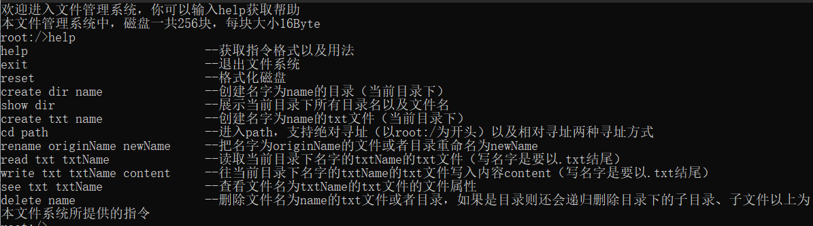

# 文件管理系统

<center><font size='5'>1850061   阮辰伟</font></center>


<div style="page-break-after: always;"></div>

[TOC]

<div style="page-break-after: always;"></div>

## 项目说明

### 项目简介

本项目为基于命令行交互的文件管理系统，在内存中开辟一个空间作为文件存储器，在其上实现一个简单的文件系统。项目通过创建了一个txt文件模拟磁盘空间，txt文件的每一行模拟磁盘块的方式来模拟磁盘空间。当用户退出这个文件系统时，项目会把该文件系统的内容保存到磁盘上，以便下次可以将其回复到内存中来。

本文件管理系统中，一共一块磁盘，磁盘中有256个块，每块大小16Byte。


### 项目环境

#### 开发环境

- 开发环境：Windows 10

- 开发软件：

  **PyCharm** *2021.1.2(专业版)*

- 开发语言

  ``` Python 3.8.2```

  

#### 运行方式

1. 进入根目录
2. 通过运行main.py运行项目

```
  python app.py 
```

4. 也可以通过点击main.exe打开该文件管理系统并运行


### 功能描述与展示

#### 进入系统

如果fileManage.txt已经存在，则加载fileManage.txt中的信息。如果不存在，则创建fileManage.txt，并且对其进行格式化。格式化后整个文件管理系统中只存在根目录。

本文件管理系统中，一共一块磁盘，磁盘中有256个块，每块大小16Byte。


#### 帮助指令

输入help来获取操作的提示




#### 退出文件系统

输入exit指令退出文件系统，并且把文件系统的信息保存到fileManage.txt中


#### 磁盘格式化

输入reset指令格式化磁盘，磁盘格式化后，整个磁盘只剩下root根目录，其余目录与文件全部被删除。


#### 创建子目录

输入create dir name指令在当前目录下创建名字name的目录。注意创建的目录名不得超过10个字母。


#### 删除子目录

输入delete name指令删除文件名为name的txt文件或者目录，如果是目录则还会递归删除目录下的子目录、子文件。


#### 显示目录

输入show dir指令展示当前目录下所有目录名以及文件名


#### 更改目录或文件名

输入rename originName newName指令把当前目录下名字为originName的文件或者目录重命名为newName


#### 创建文件

输入create txt name指令在当前目录下创建名字为name的txt文件


#### 打开文件

没有提供特定的打开文件指令，但是会在每次读写文件之前通过打开文件函数openFileUnderNow来获取文件块的物理地址以及getFCBInfo函数加载文件的FCB信息。


#### 关闭文件

没有提供特定的关闭文件指令，但是会在每次写文件结束时通过相应代码段更新文件的FCB信息，并且通过writeFCB函数把修改后的FCB写入磁盘（fileManage.txt）中。


#### 更改当前目录

输入cd path指令进入path代表的路径，支持绝对寻址（以root:/为开头）以及相对寻址两种寻址方式。

在相对寻址中，以..开头代表前往父目录，以.开头代表当前目录


#### 写文件

输入write txt txtName content指令往当前目录下名字的txtName的txt文件写入内容content（文件名txtName应该要以以.txt结尾）。

在文件写入时，会把文件中原先的内容清空。


#### 读文件

输入read txt txtName指令读取当前目录下名字的txtName的txt文件（文件名txtName应该要以以.txt结尾）


#### 查看文件信息

输入see txt txtName指令查看文件名为txtName的txt文件的文件属性


#### 删除文件

输入delete name指令删除文件名为name的txt文件或者目录，如果是目录则还会递归删除目录下的子目录、子文件。


## 功能实现

### 磁盘存储管理

#### 存储空间管理方式

本文件管理系统中，一共一块磁盘，磁盘中有256个块，每块大小16Byte。用一个txt文件代表一个磁盘，使用txt文件中的一行代表磁盘中的一个块，而用一个字母或是符号代表一个Byte。

在本文件管理系统中，0到51号磁盘块用于存储FAT信息，第52号磁盘块为root的起始磁盘块


#### FAT的存储管理

FAT的表象与全部磁盘块一一对应。因此FAT中表示下一块块号的变量可能的值为-2到255，因此在我的设计中，每一个FAT的值占用3个Byte。由于磁盘中一个块号的大小为16Byte，因此一个块能存储5个FAT的值。由此可以推断，存储所有的256个FAT表中的值一共需要52个块。

基础这些计算，我们把第0号块到第51号块分配给FAT。其中，第i块存储FAT表中第5i到5i+4的值。

下图展示了第i块磁盘块($0\le i \le 51$)中FAT的存储情况。


#### 空闲空间管理方式

我使用用FAT表中的值来表示磁盘块的状态

|   FAT表中的值    |                        该磁盘块的状态                        |
| :--------------: | :----------------------------------------------------------: |
|        -2        |                       该磁盘块未被占用                       |
|        -1        |                  该磁盘块为某文件的最后一块                  |
| $0\le i \le 255$ | 该磁盘块存储了某文件的一个部分，且该磁盘块不是这个文件的最后一块 |

当我们需要寻找一个空闲磁盘块时，我们只需要遍历FAT表，找出其中值为-2的表项，此时的盘块号就是一个空闲块。


#### FCB的存储管理

下图为一个FCB块在磁盘块中的存储示意图。


#### txt文件的存储管理

txt文件在内存中的存储内容为FCB块+文件内容+'|'符号。最后的'|'符号时用户分割用户输入的内容以及磁盘块中未存储部分。防止磁盘块中未存储部分的内容干扰到文件。

下图为txt文件的存储管理的示意图


#### 目录文件的存储管理

目录文件为每个目录下所自带的文件。目录文件不同于txt文件，其存储的内容为该目录文件的父目录文件的起始块号，以及该目录文件下的子目录，子文件的名字和他们的起始块号。这样的存储方式可以保证目录文件在有限的存储空间下存储更多的子目录、子文件信息，使得在搜查文件操作时可以减少io操作。

以下为目录文件需要注意的一些地方：

- 目录文件内容的起始位置存的是父目录的起始块号（分配3Byte存储），与其他内容用符号'|'相隔。
- 如果目录文件为根目录，其存储父目录的起始块号的位置存储的内容为-1
- 子目录，子文件信息的存储格式为 文件名+空格+起始块号。不同子文件信息之间使用'|'符号隔开。
- 子目录，子文件信息的存储中不必给每个调信息配置固定的空间，而是根据文件名大小灵活调整。

下图为目录文件的存储管理的示意图


### 文件系统提供的操作

#### 操作的使用与限制

|     具体操作     |      操作的使用方式       |                          操作的限制                          |
| :--------------: | :-----------------------: | :----------------------------------------------------------: |
|     帮助指令     |           help            |                              无                              |
|   退出文件系统   |           exit            |                              无                              |
|    磁盘格式化    |           reset           |                              无                              |
|    创建子目录    |      create dir name      | 1. 目录名不能包含中文<br/>2.目录名不能以.txt结尾<br/>3.目录名不能为空<br/>4.目录名不能与该目录下的其他文件重名<br/>5.磁盘应该留有足够空间创建该目录<br/>6. 目录名中不应该包含'/'与'\|'符号 |
|    删除子目录    |        delete name        |                        该目录必须存在                        |
|     显示目录     |         show dir          |                              无                              |
| 更改目录或文件名 | rename originName newName | 1. 原文件(originName)必须存在<br/>2.原文件与新文件必须保持同一种文件类型<br/>3. 新文件名不能包含中文<br/>4.新文件名不能为空<br/>5.新文件名不能与该目录下的其他文件重名<br/>6.磁盘应该留有足够空间更改该文件名<br/>6. 新文件名中不应该包含'/'与'\|'符号 |
|     创建文件     |      create txt name      | 1. 文件名不能包含中文<br/>2.文件名只能以.txt结尾<br/>3.文件名不能为空<br/>4.文件名不能与该目录下的其他文件重名<br/>5.磁盘应该留有足够空间创建该文件<br/>6. 文件名中不应该包含'/'与'\|'符号 |
|     打开文件     |             /             |                         文件必须存在                         |
|     关闭文件     |             /             |                         文件必须存在                         |
|   更改当前目录   |          cd path          | 1. 该路径表示的目录必须存在<br/>2.path中所有的文件名都必须为目录名，不能为.txt文件 |
|      写文件      | write txt txtName content | 1.文件名只能以.txt结尾<br/>2.该文件必须存在<br/>3.写入内容不能包含中文<br/>4. 写入内容不应该包含'/'与'\|'符号 |
|      读文件      |     read txt txtName      |         1.文件名只能以.txt结尾<br/>2.该文件必须存在          |
|   查看文件信息   |      see txt txtName      |    1.文件名（txtName）只能以.txt结尾<br/>2.该文件必须存在    |
|     删除文件     |        delete name        |                        该文件必须存在                        |


|               常见限制               |                           限制原因                           |
| :----------------------------------: | :----------------------------------------------------------: |
|             不能输入中文             | 一个中文字符占用两个字节，而我们使用txt文件来存储输入信息。如果某一个块的最后一个字节应存储一个汉字，则会非常难处理。 |
|         目录名不能以.txt结尾         | 如果目录名以.txt结尾，系统会把它当作txt文件，从而导致错误。  |
|   文件名不能与该目录下其他文件重名   |               保证用户可以通过文件名访问该文件               |
|    磁盘应该留有足够空间创建该目录    | 如果磁盘空间不够充足，应当直接不创建该文件。在这种情况下如果创建了文件，会陷入即无法使用文件又占用了磁盘空间，还难以回收磁盘空间的尴尬境地 |
| 文件名以及写入内容不应该包含'\|'符号 | '\|'符号运用于分割文件内容与磁盘块未存储部分，如果文件中包含这个字符可能会影响到文件已存储内容与为存储内容的分割。 |
|       文件名不应该包含'/'符号        | 当用户根据目录的相对地址以及绝对地址寻找想要到达的目录时，'/'符号起到分割目录名的作用。如果目录名或是文件名出现了这个符号，跟可能导致目录寻找的失败 |
|         文件名只能以.txt结尾         |                用来保证输入文件必须为txt文件                 |
|         要查看的文件必须存在         |           如果文件不存在，则不可能进行接下来的操作           |
|         文件名长度必须小于10         | 在我的设计中，我只在FCB中分配了10个Byte用于存储文件名，如果文件名超过了10，FCB将无法存储 |


#### 操作的实现

##### 帮助指令

1. 系统初始化时会把和help.txt文件加载到help列表中
2. 输入help列表


##### 退出文件系统

1. 把文件系统信息存回磁盘（fileManage.txt文件），包括FAT以及各种文件的信息
2. 退出文件系统


##### 磁盘格式化

1. 往磁盘（fileManage.txt文件）中写入256行，每行都由16个0构成
2. 生成FAT，FAT表中0号磁盘块到51号磁盘块的值都设置为-1，因为这是FAT表自身占用的内存。剩余磁盘块的值都设置为-2
3. 创建根目录，设置根目录的父目录起始磁盘块为-1
4. 不必把FAT加载回磁盘，可以等待退出文件系统时统一上传入磁盘


##### 创建子目录

1. 查看输入的目录名是否合规
   1. 如果目录名不合规，指令终止，并提示用户输入不合规
   2. 如果目录名合规，指令继续执行
2. 把子目录的名字以及起始磁盘块写入这个子目录的父目录（当前目录）的目录文件中。如果父目录的起始地址为-1则无需写入
3. 分配3个磁盘块，前两个存放目录文件的FCB，最后的磁盘块目前只存放该目录文件的父目录文件的起始块地址
4. 把目录文件写入磁盘相应位置（即为目录文件分配的3个磁盘块）
5. 如果创建子目录过程中出现磁盘空间不足的情况。则退出创建子目录程序，清空程序已经写入的信息并且告诉用户磁盘空间不足
6. 返回创建目录是否成功的信息


##### 删除文件

1. 获取要删除文件的文件名
2. 找到该文件的起始磁盘块（通过openFileUnderNow函数）
   1. 如果没找到该文件，则返回”没找到该文件“并退出程序
3. 获取该文件所占的磁盘块的所有地址，以列表的形式返回
4. 把FAT中这些磁盘块的值置为-2，并且把该磁盘块的值清零（即16个0）
5. 删除该文件的父目录文件中关于该文件的记录
6. 返回删除文件是否成功的信息


##### 删除子目录

1. 获取要删除文件的文件名

2. 找到该文件的起始磁盘块（通过openFileUnderNow函数）
   1. 如果没找到该文件，则返回”没找到该文件“并退出程序
3. 把该目录文件的起始磁盘块号块加入删除队列中
   1. 获取删除队列中最前面的磁盘块
   2. 判断这个以这个磁盘块为起始地址的文件中存储的为txt文件还是目录文件
      1. 如果存储的时txt文件
         1. 获取该文件所占的磁盘块的所有地址，以列表的形式返回
         2. 把FAT中这些磁盘块的值置为-2，并且把该磁盘块的值清零（即16个0）
      2. 如果存储的时目录文件
         1. 把该目录文件中所有的文件，目录的起始磁盘块加入删除队列中
         2. 获取该目录文件所占的磁盘块的所有地址，以列表的形式返回
         3. 把FAT中这些磁盘块的值置为-2，并且把该磁盘块的值清零（即16个0）
   3. 判断删除队列是否为空，如果不为空则回到 ”获取删除队列中最前面的磁盘块“这一步。
4. 删除该目录文件的父目录文件中关于该文件的记录
5. 返回删除子目录是否成功的信息


##### 显示目录

1. 找到该目录文件中所存储的文件名信息
2. 把这些信息输出出来


##### 更改目录或文件名

1. 获取想要更改的文件名以及新名字
2. 检测新名字是否合规。（查看新名字中是否出现中文，"|"符号等违规字符，新名字长度是否小于10等）
   1. 如果新名字不合规，指令终止，并提示用户输入不合规
   2. 如果新名字合规，指令继续执行
3. 获取重命名文件的父目录文件所存储的信息
4. 获取文件重命名后父目录文件所存储的信息
   1. 文件重命名后父目录所占的磁盘块更少
      1. 清空多余的磁盘块
      2. 更新FAT表
      3. 把新的父目录文件写入磁盘中相应的块
   2. 文件重命名后父目录所占的磁盘块不变或变多
      1. 申请需要新增的磁盘块
         1. 如果申请成功，指令继续执行
         2. 如果申请失败，指令中止，并返回用户”重命名失败，（磁盘空间不足）“
      2. 更新FAT表
      3. 把新的父目录文件写入磁盘中相应的块
5. 获取需要重命名文件的FCB，更改他的文件名以及最近修改时间
6. 把新的FCB写入磁盘中
7. 返回更改文件名是否成功的信息


##### 创建文件

没有提供特定的打开文件指令，但是会在每次读写文件之前通过打开文件函数openFileUnderNow来获取文件块的物理地址以及getFCBInfo函数加载文件的FCB信息。


##### 关闭文件

  没有提供特定的关闭文件指令，但是会在每次写文件结束时通过相应代码段更新文件的FCB信息，并且通过writeFCB函数把修改后的FCB写入磁盘（fileManage.txt）中。


##### 更改当前目录

1. 获取想要进入的目录地址
2. 检测目录地址是否合规。（查看目录地址中是否出现中文，"|"符号等违规字符等）
   1. 如果目录地址不合规，指令终止，并提示用户输入不合规
   2. 如果目录地址合规，指令继续执行
3. 通过’/‘符号分割输入的目录地址
4. 查看用户最先输入
   1. 如果最先输入的为'root:/'，说明用户采用绝对寻址寻址方式，起始磁盘块应为52
   2. 如果最先输入的不为'root:/'，说明用户采用相对寻址寻址方式，起始磁盘块应为当前目录的起始磁盘块号
5. 遍历用户所输入的目录
   1. 如果用户输入'.'，表示停留在当前目录
   2. 如果用户输入'..'，表示返回上一级目录
      1. 如果上一级目录的起始磁盘块号为-1，说明用户已经处于根目录中，无法回退。此时指令中之，并且提示用户”您已经在根目录，无法回退“
   3. 如果用户输入空格，直接跳过
   4. 否则则寻找当前目录下是否存在该目录
      1. 如果存在，更新当前目录的值，并继续查找直至找完用户输入的所有目录
      2. 如果不存在，指令中之，并提示用户”未找到该目录“
   5. 返回最终的磁盘块号，并进入
   6. 合并当前路径以及用户输入的文件路径（combinePath函数）


##### 写文件

1. 获取想要写入的文件名以及写入内容
2. 检测写入内容是否合规。（查看新名字中是否出现中文，"|"符号等违规字符等）
   1. 如果写入内容不合规，指令终止，并提示用户输入不合规
   2. 如果写入内容合规，指令继续执行
3. 寻找该文件的起始磁盘块
   1. 如果寻找成功，指令继续执行
   2. 如果寻找失败，指令中止，并返回用户”没找到该文件“
4. 获取该文件中原先存储的内容
5. 对比文件原先存储的内容以及新存储的内容，根据文件写入后所需的磁盘块增多还是减少做出不同回应
   1. 文件写入后该文件所占的磁盘块更少
      1. 清空多余的磁盘块
      2. 更新FAT表
      3. 把新的文件内容写入磁盘中相应的块
   2. 文件写入后该文件所占的磁盘块不变或变多
      1. 申请需要新增的磁盘块
         1. 如果申请成功，指令继续执行
         2. 如果申请失败，指令中止，并返回用户”重命名失败，（磁盘空间不足）“
      2. 更新FAT表
      3. 把新的文件内容写入磁盘中相应的块
6. 获取需要写入文件的FCB，更改他的文件大小以及最近修改时间
7. 把新的FCB写入磁盘中
8. 返回写入文件是否成功的信息


##### 读文件

1. 获取想要读取的文件名
2. 检测文件名是否合规。（是否以'.txt'结尾）
   1. 如果文件名不合规，指令终止，并提示用户输入不合规
   2. 如果文件名合规，指令继续执行
3. 寻找该文件的起始磁盘块
   1. 如果寻找成功，指令继续执行
   2. 如果寻找失败，指令中止，并返回用户”没找到该文件“
4. 获取该文件的文件内容（通过findDirStr函数）
5. 返回读取文件的内容，如果文件空，则返回字符”空“


##### 查看文件信息

1. 获取想要查看的文件名
2. 检测文件名是不是以.txt结尾
   1. 如果是，则继续执行
   2. 如果不是，则中止指令，并提示用户”只允许查看以.txt文件“
3. 通过该目录的目录文件以及文件名查找该文件的起始磁盘块
   1. 如果找到该文件，则继续执行
   2. 如果没找到，则中止指令，并且告诉用户”没找到该文件“
4. 读取、输出该文件的FCB中的信息


## 项目总结

### 项目亮点

- 采用命令行交互方式，十分简洁
- 提供了较为全面的文件系统操作
- 本项目对磁盘的操作精确到了一个字节，可以很好的帮助用户理解文件系统
- 异常处理系统强大，拥有检测用户输入是否违法、用户输入文件是否存在、磁盘是否仍然存在空间等多种功能


### 项目不足与改进方向

- 本项目不支持中文输入，为了使得项目交互性更好，可以考虑对于中文的支持
- 本项目基于命令行交互，为了使得项目交互性更好，可以考虑开发一个图形化界面
- 本项目未考虑多人同时对文件操作的情况，可以考虑引入信号量的机制来保证文件访问的安全
- 展示当前目录下文件以及展示文件信息时可以采用更加清晰的展示方式
